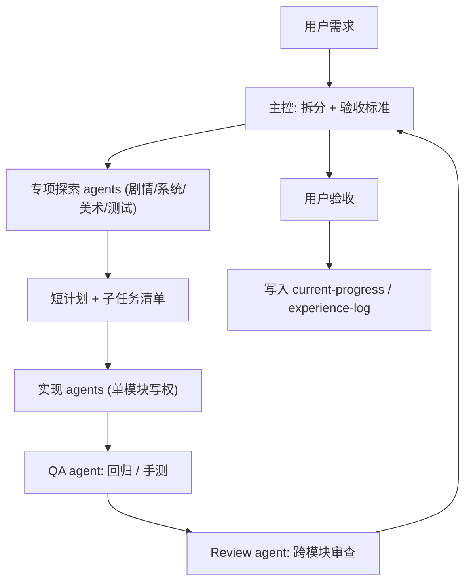

# 多 Agent 协作工作流（v0.1）

> 用途：规范 RPG_GAME 项目下，多个 AI agent（含人类协作者）按模块分工时的角色、职责、交接格式与验收标准。
> 维护原则：**职责边界清晰、单模块单写权、主控统一集成**。
> 配套文档：`docs/ai-rules.md`（AI 开发硬规则）、`docs/ui-style-guide.md`（当前 UI 规范）、`docs/change-template.md`（变更模板）、`docs/module-owners.md`（模块归属表）、`docs/agents/`（独立角色记忆）、`docs/acceptance-checklists/`（每类工作的验收清单）。


---

## 1. 为什么需要多 Agent

项目已横跨剧情设定、Godot 系统、战斗数值、任务数据、美术管线、自动化测试。继续由单一 agent 在所有方向来回切换，会出现以下副作用：

- 上下文污染：上一段美术 prompt 调试残留进了 Godot 脚本修改。
- 风格不一致：剧情口吻、命名、UI 文案在不同会话里飘。
- 经验记录遗漏：踩坑只解决当下，未沉淀到 `docs/experience-log.md`。
- 重复试错：同一个图像生成失败重复多次跑相同的 fallback。

多 Agent 不是为了并行得多快，而是为了 **每个模块由稳定职责的 agent 持有，主控做集成与决策**。从 v0.2 起，每个角色还拥有自己的 `docs/agents/<role>-memory.md`，避免剧情、美术、系统、战斗、QA 记忆互相污染。

---

## 2. 角色与边界

固定 7 个角色（同一会话也可由一个 agent 切换扮演，但每次开口必须先声明当前角色、目标模块和读取的 `memory_files`）。

### 2.1 主控 / 制作人 agent（producer）

- 唯一对用户负责的角色。
- 启动任何复杂任务前，必须先读：`AGENTS.md`、`docs/current-progress.md`、`docs/agent-workflow.md`、`docs/module-owners.md`、`docs/agents/README.md`、`docs/agents/producer-memory.md`、`docs/experience-log.md`，以及本任务相关的设计文档。
- 输出：任务拆分（2～4 个子任务）、目标模块、验收标准、是否需要并行探索。
- 决策：模型选择、是否进入实现阶段、是否打回返工、是否纳入下一里程碑。
- 不直接写实现代码或 prompt，除非是一两行的串联调整。
- 负责把跨角色决策写回 `docs/agents/producer-memory.md`。

### 2.2 剧情 / 世界观 agent（lore）

- 模块：`docs/world-bible.md`、`docs/design-mvp-chapter1.md`、`game/data/dialogs/*.tres` 中的 `speaker`/`text`/`choices`、任务文案 `game/data/quests/*.tres`、命名禁忌（无蜘蛛意象等）。
- 记忆：`docs/agents/lore-memory.md`。
- 输出：对话节点 / 任务文案 / NPC 口吻 / 章节剧情走向。
- 不能改：Godot 脚本逻辑、战斗数值、美术 prompt。
- 强约束：所有命名以 `world-bible.md v0.3+` 为准；旧 IP 名（沈不归 / 清风镇 / 黑教等）在新写时必须替换为冷孤云 / 竹尾村 / 茗雾山庄等。

### 2.3 Godot 系统 agent（system）

- 模块：`game/scripts/autoload/*.gd`（EventBus / GameState / Inventory / SceneRouter / SaveManager / DialogPlayer / QuestManager）、`game/scripts/field/*.gd`、`game/scripts/ui/*.gd`、`game/scripts/domain/*.gd`、对应 `game/scenes/*.tscn`、`game/project.godot`。
- 记忆：`docs/agents/system-memory.md`。
- 输出：场景路由、存档 schema、背包/装备、商店、UI、输入与状态机。
- 不能改：剧情文本字段、战斗数值表、`prompts/`。
- 强约束：autoload 之间的事件流以 `EventBus` 为唯一通道；存档 schema 升版必须同步迁移函数与 `experience-log` 记录。

### 2.4 战斗 / 数值 agent（battle）

- 模块：`game/scripts/battle/battle_controller.gd`、`game/data/skills/*.tres`、`game/data/enemies/*.tres`、`game/data/equipment/*.tres`（数值字段）、相关单测。
- 记忆：`docs/agents/battle-memory.md`。
- 输出：技能数值、敌人数值、回合体验、装备加成、状态异常。
- 不能改：UI 排版、剧情文案。
- 强约束：所有调参必须留下「调整理由 + 期望体验 + 实测对比」三句话，写到对应 `.tres` 的 git commit 信息或 `docs/experience-log.md`。

### 2.5 美术管线 agent（art）

- 模块：`prompts/templates/*.yaml`、`prompts/tasks.yaml`、`scripts/gen_assets.py` 的命令行调用、`scripts/build_sprite_preview.py`、`scripts/postprocess.py`、`assets/raw/`、`assets/processed/`、`assets/previews/`、`docs/sprite-prompt-playbook.md`、`docs/style-bible-prompts.md`。
- 记忆：`docs/agents/art-memory.md`。
- 输出：prompt 模板、出图任务、动画拆分与预览脚本、最终入库的 sheet。
- 不能改：Godot 引擎中如何加载贴图的代码（属系统 agent）。
- 强约束：每次出图任务必须写入 `prompts/tasks.yaml` 而不是临时改 prompt；批量出图前必须 dry-run，禁止默认开自动 fallback 到不预期的模型。

### 2.6 测试 / QA agent（qa）

- 模块：`game/tests/*.gd`、`scripts/smoke_test.py`、`scripts/verify.py`、`scripts/check_dmxapi.py`、`docs/mvp-m*-checklist.md`、`docs/acceptance-checklists/`。
- 记忆：`docs/agents/qa-memory.md`。
- 输出：自动化测试、手测脚本、回归用例、bug 复现记录。
- 不能改：被测代码本身；发现 bug 时只能写复现步骤，由对应实现 agent 修。
- 强约束：每次 sprint 完成必须跑一遍当期 milestone checklist，并把跑过的命令、状态写回 `current-progress.md`。

### 2.7 代码审查 agent（review）

- 模块：所有人改动 PR / 工作区 diff，不写新功能。
- 记忆：`docs/agents/review-memory.md`。
- 输出：代码审查意见、回归风险、是否符合 `experience-log` 已记录的踩坑约束。
- 强约束：只看 diff，不主动扩范围；审查发现新坑必须建议补 `experience-log`。

---

## 3. 标准工作流



关键纪律：

- **同一模块同时只有一个写权 agent**；其他角色只读。
- **探索可并行，写改必须串行**；多模块改动由主控按依赖顺序排队。
- **每个子任务必须给出验收标准**，否则不能进入实现阶段。

---

## 4. 模型选择建议

不强制每个角色绑定模型，但建议如下分层（与 Cursor / Claude Code 等工具的可用模型匹配）：

| 角色 | 推荐能力 | 备注 |
|------|----------|------|
| producer / review / 复杂排障 | 强推理模型 | 关注全局，输出取舍判断 |
| system / battle / 实现 agent | 擅长代码模型 | 关注语法、API、回归 |
| lore / 文档归档 | 速度快、成本低模型 | 字处理为主，避免烧高价 token |
| art prompt 设计 | 强推理模型 | prompt 复杂度高，需要长上下文规划 |
| 出图实际调用 | 不是 LLM | 由 `scripts/gen_assets.py` 控制实际图像模型与预算 |

模型可换，**职责不能随模型一起飘**。

---

## 5. 交接格式

每次 agent 之间交接（包括同一会话中切换角色），必须用以下结构化片段，避免上下文模糊：

```
[handoff]
from: <角色>
to: <角色>
goal: <一句话目标>
memory_files:
  - docs/agents/<role>-memory.md
context_files:
  - <相关文件路径>
expected_output:
  - <文件 / 数据 / 结论>
acceptance:
  - <可验证条件>
constraints:
  - <禁止动作 / 范围限制>
```

任何 agent 收到不带 `memory_files` 或 `acceptance` 的请求，应当先补齐再开工。角色完成后，应把新增的角色经验写回自己的 memory；跨角色经验写回 `producer-memory.md`；可复用踩坑写入 `docs/experience-log.md`。

---

## 5.1 角色记忆读写规则

| 阶段 | 读取 | 写回 |
|------|------|------|
| producer 启动 | `AGENTS.md` / `current-progress.md` / `agent-workflow.md` / `module-owners.md` / `agents/README.md` / `producer-memory.md` / `experience-log.md` | `producer-memory.md`、`current-progress.md` |
| 专项 agent 启动 | 自己的 `docs/agents/<role>-memory.md` + 相关源文件 + 对应 checklist | 自己的 memory |
| QA | `qa-memory.md` + 对应验收清单 + 被测产物 | `qa-memory.md`、日志路径 |
| Review | `review-memory.md` + 相关角色 memory + diff | `review-memory.md`、必要时 `experience-log.md` 建议 |
| 重大坑 | 相关 role memory + `experience-log.md` | 二者都写，memory 写短结论，experience-log 写完整复盘 |

角色 memory 只保存长期有用的规则、命令、坑点和当前模块状态；不要把整段聊天或整份设计文档复制进去。

---

## 6. 验收标准

通用标准（所有模块都要满足）：

- 改动后能在 Godot 编辑器中无解析错误打开。
- `docs/current-progress.md` 反映了真实状态（不留过期勾选）。
- 新坑写入 `docs/experience-log.md`，新经验写入对应 playbook（如 `sprite-prompt-playbook.md`）。
- 不引入新的旧 IP 命名（沈不归 / 清风镇 / 黑教 / 蜘蛛意象等）。

模块化标准放在 `docs/acceptance-checklists/`：

- `docs/acceptance-checklists/lore.md`
- `docs/acceptance-checklists/system.md`
- `docs/acceptance-checklists/battle.md`
- `docs/acceptance-checklists/art.md`
- `docs/acceptance-checklists/qa.md`

每次 milestone 验收必须按对应清单逐项打勾。

---

## 7. 并行与串行规则

| 场景 | 并行 ok | 必须串行 |
|------|---------|----------|
| 多个 agent 探索不同模块 | 是 | - |
| 同一文件多 agent 写改 | 否 | 是 |
| 不同 autoload 同时改 | 限有限 | 影响存档 schema 时必须串行 |
| 美术批量出图 + Godot 引擎升级 | 是 | - |
| 改 `EventBus` 信号 + 改订阅方 | 否 | 必须先信号后订阅 |
| 改对话 `.tres` `speaker` 文案 | 是（按场景拆分） | 同一文件改时排队 |

---

## 8. 试运行示例：当前 sprite 行走帧迭代

把当前正在做的「冷孤云 8 帧右走 strip 优化」按本工作流走一遍，作为参考。

```
[handoff]
from: producer
to: art
goal: 让 8 帧右走能闭环且帧间动作均匀
memory_files:
  - docs/agents/art-memory.md
context_files:
  - prompts/templates/sprite_protagonist_walk_right_8f_loop_strip.yaml
  - prompts/tasks.yaml
  - assets/raw/sprite/v3/sprite_lengguyun_walk_right_8f_loop_strip.png
  - scripts/build_sprite_preview.py
  - docs/experience-log.md (§15.13~§15.14)
expected_output:
  - 一张通过 loop check 的 9 格 strip
  - 一份 8 帧 GIF 预览
acceptance:
  - `check_sprite_strip.py --expected 9` 能检出 9/9，脚底基线极差 <= 12 px
  - 固定锚点 GIF 目视无明显 8→1 跳帧
  - 衣袍颜色为冷灰，非帧间漂移
  - 不出现头巾 / 额带 / 红头绳
constraints:
  - 仅使用 gpt-image-2，禁止自动 fallback 到 1.5
  - 单次预算 <= ¥1，超出需 producer 决策
```

完成后：

```
[handoff]
from: art
to: qa
goal: 确认 GIF 接缝与帧大小符合验收
memory_files:
  - docs/agents/qa-memory.md
context_files:
  - assets/previews/sprite/sprite_lengguyun_walk_right_9f_with_loopcheck.gif
  - assets/processed/sprite/sprite_lengguyun_walk_right_8f_loopcheck.png
expected_output:
  - acceptance 中每条的实测结论（通过 / 不通过 + 数值）
acceptance:
  - 形成可复制的实测命令 / 截图
constraints:
  - 不修改 prompts/templates/，发现问题打回 art
```

QA 通过后：

```
[handoff]
from: qa
to: producer
goal: 决定是否将该 sheet 接入 Godot 或继续迭代
memory_files:
  - docs/agents/producer-memory.md
expected_output:
  - 是否进入下一阶段（系统 agent 接图）
  - 经验是否需要追加 experience-log
```

---

## 9. 维护

- 角色 / 模块归属变化：先改 `docs/module-owners.md`，再回写本文件 §2。
- 角色记忆规则变化：先改 `docs/agents/README.md`，再回写本文件 §5.1 与 `AGENTS.md`。
- 新增类型的工作（如音频）：在本文件 §2 增加角色后，建立对应 `docs/acceptance-checklists/<role>.md`。
- 任何角色发现自己反复越界，必须把越界场景写到 `experience-log.md`，由 producer 决定是否调整边界。

---

_最后更新：2026-04-30（v0.2：增加独立角色记忆 `docs/agents/`）_
